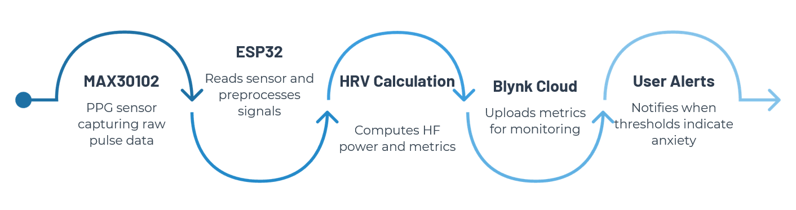
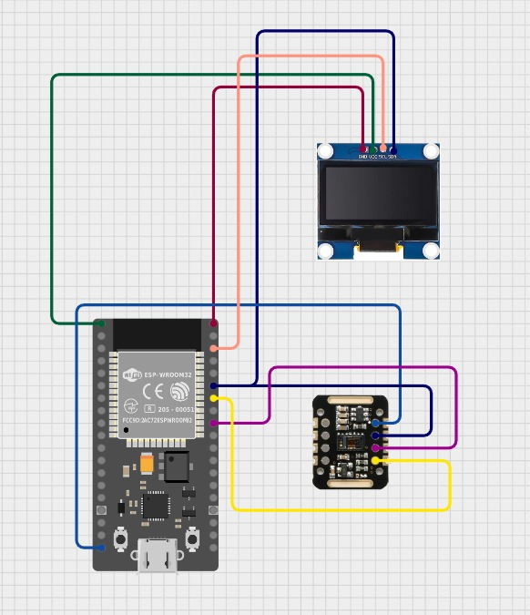
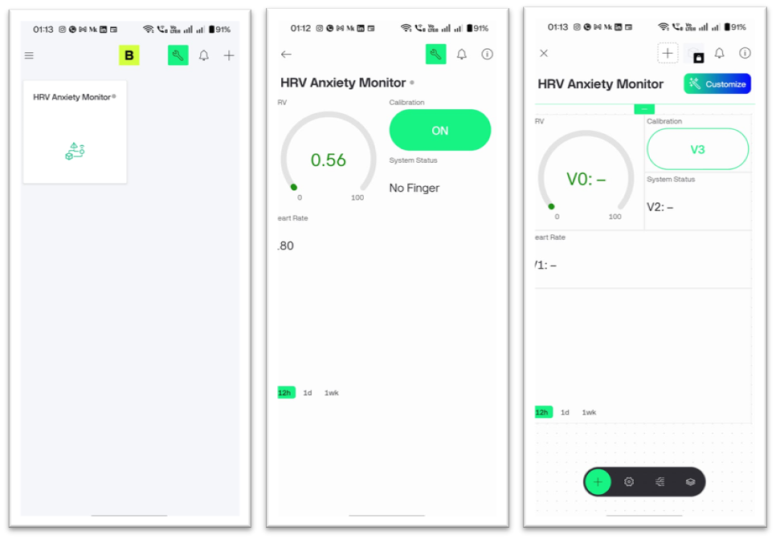
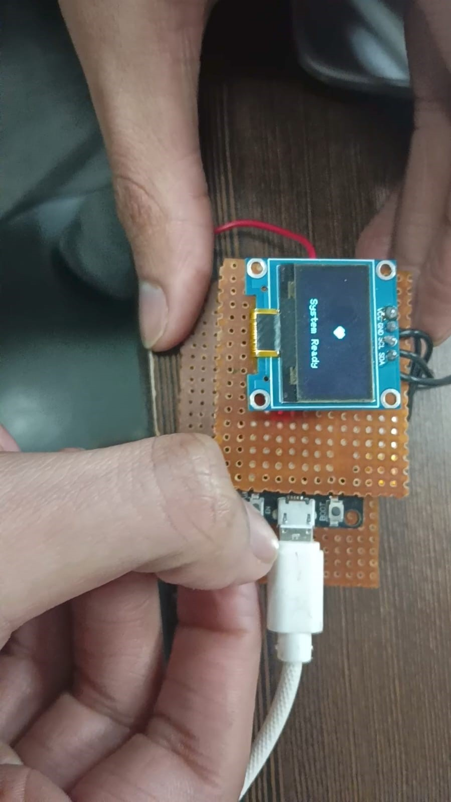
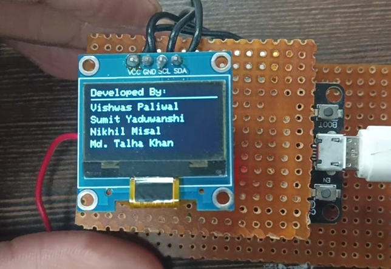

# IoT-Based Heart Rate Variability (HRV) Monitor for Anxiety Detection

A real-time, non-invasive wearable system that detects anxiety by monitoring Heart Rate Variability (HRV) using IoT and biomedical engineering principles.

---

## 📌 Table of Contents
- [Overview](#overview)
- [Features](#features)
- [System Architecture](#system-architecture)
- [Hardware Components](#hardware-components)
- [Circuit Connections](#circuit-connections)
- [Software & Firmware](#software--firmware)
- [How It Works](#how-it-works)
- [Results](#results)
- [Future Scope](#future-scope)
- [Team](#team)

---

## Overview

Anxiety disorders affect millions of people globally, yet real-time physiological monitoring tools remain either clinically invasive or prohibitively expensive. This project addresses that gap with a **low-cost (~₹935), wearable IoT device** capable of detecting anxiety in real-time using Heart Rate Variability (HRV) analysis.

The system uses a **MAX30102 PPG sensor** to capture pulse data, which is processed by an **ESP32 microcontroller** to calculate the RMSSD metric. When HRV drops below a threshold (indicating elevated stress), the system triggers alerts locally via an **OLED display and buzzer**, and remotely via the **Blynk IoT cloud platform**.

This project was developed as a Minor Project-I for the Bachelor of Technology in Electronics and Communication Engineering at **Sagar Institute of Science & Technology, Bhopal (SISTec)**, under the guidance of **Prof. Meha Shrivastava**.

---

## Features

- ✅ **Real-time HRV Monitoring** — Updates anxiety status after every single heartbeat (<1 second latency)
- ✅ **Custom Signal Processing** — First-principles RMSSD algorithm with Refractory Period debouncing (no black-box libraries)
- ✅ **Circular Buffer Architecture** — Rolling window of 20 samples for instant metric recalculation
- ✅ **Adaptive Calibration Mode** — Learns user's personal HRV baseline for personalized, accurate detection
- ✅ **Blynk IoT Integration** — Remote monitoring, data logging, and cloud alerts via smartphone
- ✅ **Anti-Flicker OLED Display** — Partial screen refresh for a stable, professional UI
- ✅ **Non-Blocking Buzzer Alarm** — 5-second audible alert without interrupting background sensor reads
- ✅ **No-Finger Detection** — Automatically pauses monitoring when sensor is unattended

---

## System Architecture

```
┌──────────────┐     I2C      ┌──────────────────────────────────────┐
│  MAX30102    │ ──────────▶  │           ESP32 (WROOM-32)           │
│ PPG Sensor  │              │                                        │
└──────────────┘              │  • Peak Detection                    │
                              │  • RR Interval Calculation           │
                              │  • RMSSD Computation                 │
                              │  • Threshold Decision                │
                              └────────┬─────────┬──────────┬────────┘
                                       │         │          │
                                  I2C  │    GPIO │   Wi-Fi  │
                                       ▼         ▼          ▼
                               ┌──────────┐ ┌────────┐ ┌──────────────┐
                               │   OLED   │ │ Buzzer │ │  Blynk Cloud │
                               │ Display  │ │ Alarm  │ │  (Mobile App)│
                               └──────────┘ └────────┘ └──────────────┘
```

**Workflow:** MAX30102 → ESP32 (HRV Calculation) → Blynk Cloud → User Alerts



---

## Hardware Components

| Component | Specification | Role |
|---|---|---|
| **ESP32 WROOM-32** | Dual-Core 240MHz, 520KB SRAM, Wi-Fi + BT | Central processing unit & IoT gateway |
| **MAX30102** | Red (660nm) + IR (880nm) LEDs, 18-bit ADC, I2C | PPG pulse sensing |
| **SSD1306 OLED** | 128×64px, I2C, 3.3–5V | Real-time BPM/HRV display |
| **Piezoelectric Buzzer** | Active, ~2.5kHz, <30mA | Auditory anxiety alert |
| **TP4056 Module** | Li-ion charger module | Battery charging |
| **500mAh Li-Po Battery** | 3.7V | Portable power supply |

---

## Circuit Connections

### Power Rail
| ESP32 Pin | Component |
|---|---|
| 3V3 | VCC of MAX30102, VCC of OLED |
| GND | GND of MAX30102, OLED, and Buzzer (–) |

### I2C Bus (Shared)
| ESP32 Pin | Connected To |
|---|---|
| GPIO 21 (SDA) | SDA of MAX30102 + SDA of OLED |
| GPIO 22 (SCL) | SCL of MAX30102 + SCL of OLED |

### Buzzer
| ESP32 Pin | Connected To |
|---|---|
| GPIO 26 | Positive (+) leg of Buzzer |



---

## Software & Firmware

### Development Environment
- **IDE:** Arduino IDE
- **Language:** C/C++
- **Approach:** First Principles (custom signal processing — no black-box heart rate libraries)

### Libraries
| Library | Purpose |
|---|---|
| `Wire.h` | I2C communication |
| `MAX30105.h` (SparkFun) | Low-level sensor register config & raw IR data |
| `WiFi.h` | TCP/IP stack & Wi-Fi connection |
| `BlynkSimpleEsp32.h` | Blynk cloud authentication & data transmission |
| `Adafruit_GFX.h` | Graphics primitives for OLED |
| `Adafruit_SSD1306.h` | OLED display driver |

### Key Algorithms

**1. Refractory Period (Beat Detection)**
- `BEAT_TRIGGER = 12000` — IR value must exceed this to register a beat
- `MIN_IBI_MS = 300ms` — Ignores signals within 300ms (prevents double-counting, caps at 200 BPM)
- `MAX_IBI_MS = 2000ms` — Discards intervals > 2 seconds as motion artifacts

**2. Circular Buffer (Rolling Window)**
- Stores the last 20 valid IBI values in `ibiHistory[20]`
- Uses modulo indexing (`bufferIndex % SAMPLE_SIZE`) to overwrite oldest entry
- Enables instant HRV recalculation on every single heartbeat

**3. RMSSD Formula**

$$RMSSD = \sqrt{\frac{1}{N-1} \sum_{i=1}^{N-1}(IBI_{i+1} - IBI_i)^2}$$

A lower RMSSD indicates reduced parasympathetic (vagal) activity, which correlates with stress and anxiety.

**4. Adaptive Calibration**
- Triggered via the Blynk App (V3 button)
- Collects 20 resting-state HRV samples and calculates a `personalBaseline`
- This personalized threshold replaces the default 20ms threshold for higher accuracy

### Blynk Datastreams
| Virtual Pin | Widget | Data |
|---|---|---|
| V0 | Gauge | Real-time HRV (RMSSD) in ms |
| V1 | Value Display | Real-time Heart Rate (BPM) |
| V2 | String | System Status ("Relaxed" / "ANXIETY!") |
| V3 | Button | Calibration Trigger |



---

## How It Works

1. **Place finger** on the MAX30102 sensor
2. ESP32 detects each heartbeat peak from the raw IR signal
3. Inter-Beat Intervals (IBIs) are stored in a rolling buffer of 20 samples
4. **RMSSD** is calculated after every new beat
5. If RMSSD falls **below the threshold** → anxiety is flagged
   - OLED displays **"ANXIETY!"**
   - Buzzer sounds for **5 seconds**
   - Blynk app receives **"Stress Detected"** alert
6. If RMSSD is **above the threshold** → system shows **"Relaxed"**


---

## Results

### Case Study 1 — Relaxed State
| Metric | Value |
|---|---|
| BPM | 70–75 bpm |
| HRV (RMSSD) | > 35 ms |
| System Status | ✅ Relaxed |

### Case Study 2 — Simulated Anxiety (Rapid Breathing)
| Metric | Value |
|---|---|
| HRV (RMSSD) | < 20 ms |
| System Status | 🚨 ANXIETY! |
| Buzzer | Triggered (5 sec) |
| Blynk | "Stress Detected" alert sent |

### Performance
- **Response Latency:** < 1 second per heartbeat
- **Calibration Impact:** Significantly reduced false positives for users with naturally low HRV
- **Display:** Stable anti-flicker OLED with no visual glitches





---

## Team

- **Vishwas Paliwal**
- **Sumit Yaduwanshi**
- **Nikhil Misal**

**Supervisor:** Prof. Meha Shrivastava (Assistant Professor)  
**Institution:** Sagar Institute of Science & Technology, Bhopal (SISTec)  
**Affiliation:** Rajiv Gandhi Proudyogiki Vishwavidyalaya, Bhopal  
**Duration:** August 2025 – December 2025

---

## References

1. Jayathilake et al. (2023) — *Accurate Stress Detection for Developers: Leveraging Low-Cost IoT Devices (ESP32 and MAX30102)*. ICAC 2023.
2. Lyzwinski et al. (2023) — *PPG-Based HRV Analysis and Machine Learning for Mental Health Assessment*
3. Liu et al. (2023) — *Wearable AI for Anxiety Detection: Systematic Review and Meta-Analysis*
4. [SparkFun MAX3010x Sensor Library](https://github.com/sparkfun/SparkFun_MAX3010x_Sensor_Library)
5. [Cleveland Clinic — Heart Rate Variability (HRV)](https://my.clevelandclinic.org/health/symptoms/21773-heart-rate-variability-hrv)

---

> Aligns with **UN SDG Goal 3** — Good Health and Well-being
